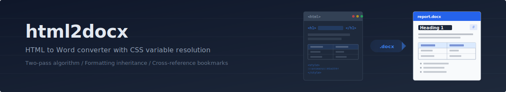
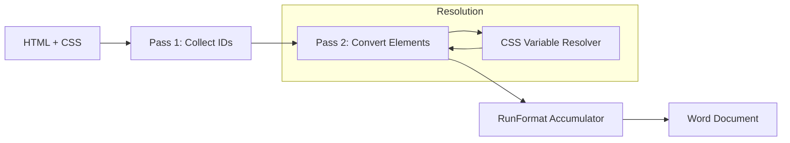

<p align="center">
  
</p>

<p align="center">
  <a href="https://github.com/protectyr-labs/html2docx/actions/workflows/ci.yml"></a>
  <a href="LICENSE"></a>
  <a href="https://python.org"></a>
  <a href="https://github.com/protectyr-labs/html2docx"></a>
</p>

---

Convert styled HTML into properly formatted Word documents. Tables, headings, lists, inline formatting, CSS variables, and cross-reference bookmarks all survive the conversion intact.

> [!NOTE]
> Built for report pipelines where HTML is the authoring format and `.docx` is the delivery format. If your app generates HTML reports, dashboards, or assessments and clients need Word files, this handles the translation.

## Quick Start

```bash
pip install git+https://github.com/protectyr-labs/html2docx.git
```

```python
from html2docx import HTMLToDocx

converter = HTMLToDocx()
converter.convert_file("report.html", "report.docx")
```

## How It Works



**Pass 1** walks the HTML tree and collects every element `id` into a set. This allows Pass 2 to generate Word bookmarks and cross-references in a single forward pass without backpatching.

**Pass 2** dispatches each element to a dedicated handler (headings, paragraphs, tables, lists, code blocks, images, blockquotes) while a `RunFormat` dataclass accumulates inline formatting through nested elements using copy-on-descent.

The **CSS Variable Resolver** parses `:root` declarations before conversion begins, replacing `var(--name)` and `var(--name, fallback)` references with their resolved values so that `style="color: var(--primary)"` produces the correct `RGBColor` in the output document.

## Supported Elements

| Element | Support |
|---------|---------|
| Headings (h1-h6) | Full, with bookmark generation |
| Paragraphs | Full, with color and alignment |
| Tables | Full, thead/tbody, header shading, borders |
| Lists (ul/ol) | Full, nested, ordered and unordered |
| Inline formatting | Bold, italic, underline, color, code |
| Code blocks | Monospace font, preserved whitespace |
| Images | Embedded from local path |
| Links | Internal (bookmarks) + external |
| CSS variables | `var(--primary)` resolved from `:root` |

## Use Cases

**Report generation.** Your app generates HTML reports (dashboards, assessments, audits). Clients need Word documents for internal distribution. This converts HTML to DOCX preserving formatting, tables, and cross-references.

**Document automation.** Template-driven document generation where HTML/CSS is easier to design and iterate on, but the final deliverable must be a Word file.

**Compliance deliverables.** Security assessments, audit reports, and compliance documents that need proper headings, numbered sections, and table formatting in Word.

## Design Decisions

**Two-pass over single-pass.** Word bookmarks require a numeric ID at creation time, and internal links need to know whether their target exists before the target element is processed. Collecting all IDs first avoids backpatching and keeps Pass 2 as a clean forward walk.

**RunFormat as a dataclass.** HTML inline formatting nests arbitrarily (`<em><strong><span style="color:red">text</span></strong></em>`). Each nesting level can add formatting but should never remove what a parent applied. The copy-on-descent pattern means bold inside italic produces bold+italic, and no formatting is lost when exiting a nested element.

**CSS variable resolution before color parsing.** Modern HTML generators use CSS custom properties extensively. Word has no concept of CSS variables, so the resolver substitutes values from `:root` before any color parsing occurs. Supports fallback syntax: `var(--missing, #333)`.

**Color normalization.** Dark greys like `#1E293B` that render fine in browsers become nearly unreadable in Word. The converter is designed to handle these edge cases at the color-parsing layer.

## Limitations

- No flexbox/grid layout (Word does not support CSS layout models)
- No external CSS file loading (inline `<style>` blocks only)
- No JavaScript rendering (static HTML only)
- Images must be local files (no remote URL fetching)
- No colspan/rowspan in tables
- Complex nested tables may lose formatting

See [ARCHITECTURE.md](./ARCHITECTURE.md) for the full technical walkthrough.

## Origin

Built at [Protectyr Labs](https://github.com/protectyr-labs) for internal use in cybersecurity report pipelines. Security assessments, compliance audits, and client deliverables are authored in HTML (easier to template, preview, and version control) and converted to Word for client delivery. Extracted as a standalone library when the pattern proved reusable across multiple projects.

## License

MIT
